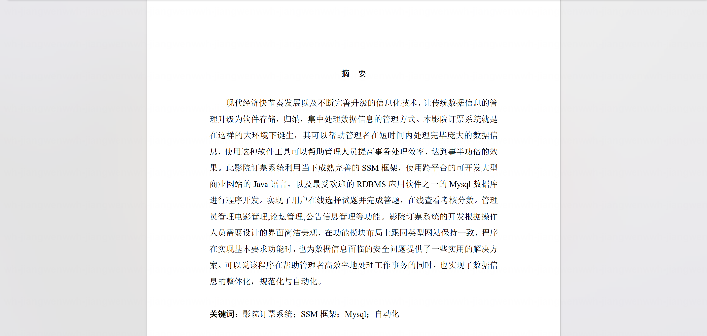
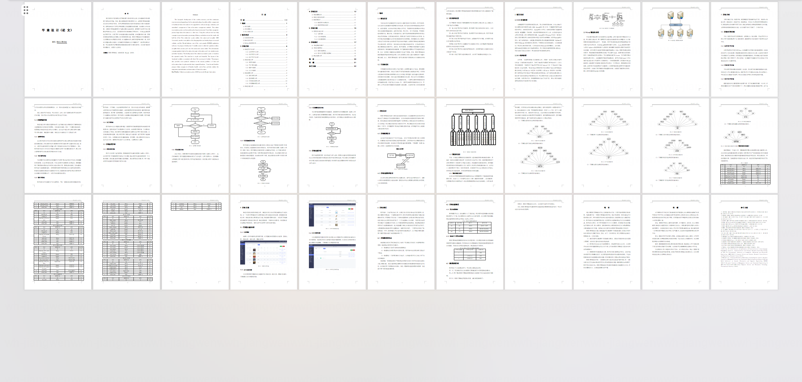
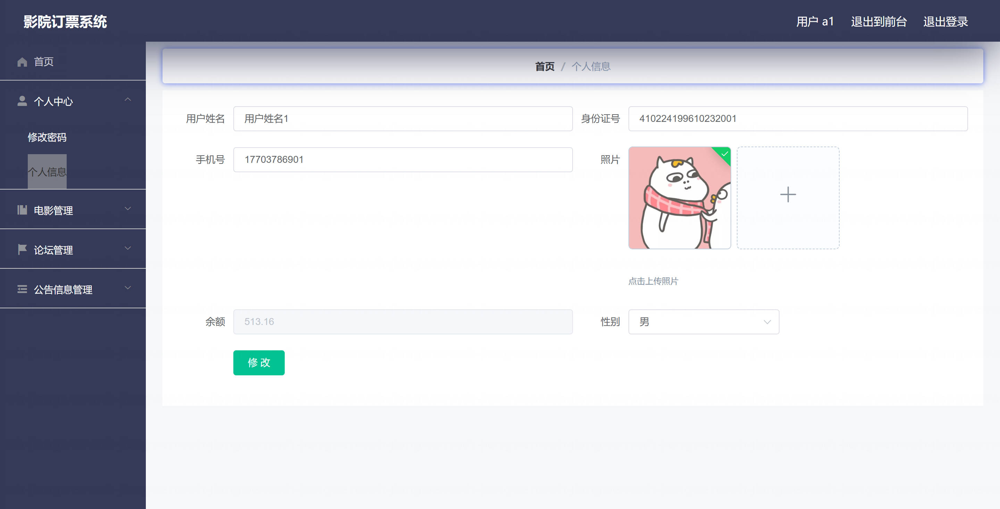
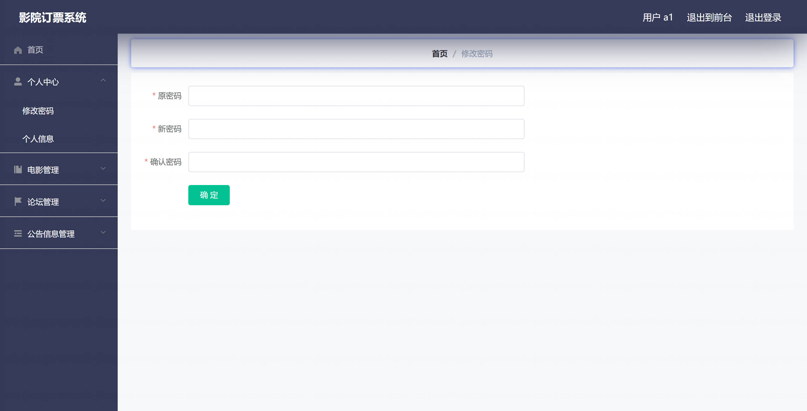
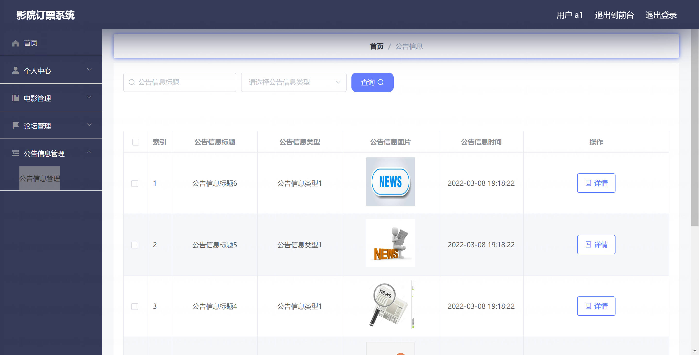
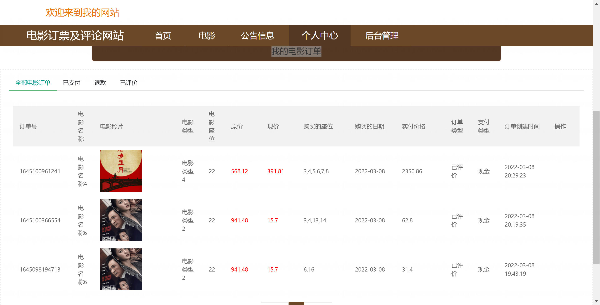
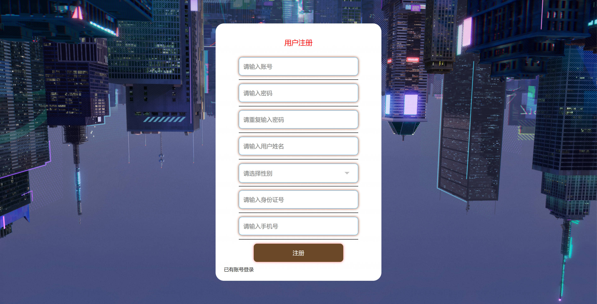
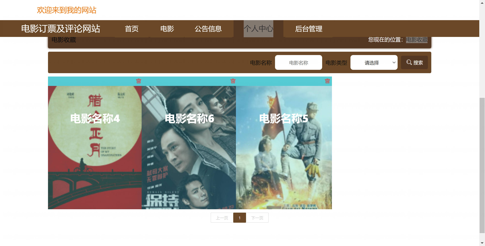
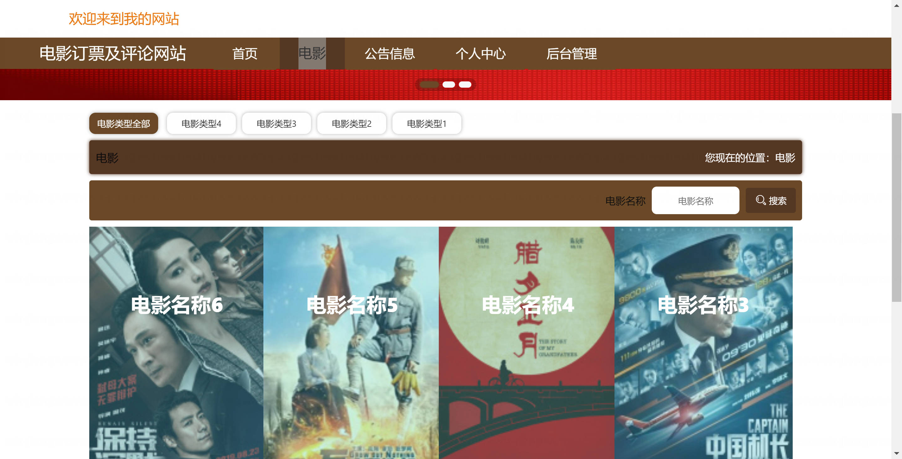
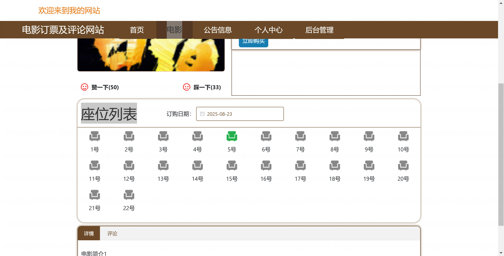

基于Springboot的影院订票系统（程序+论文）
=

### 完整代码获取地址：从戎源码网 ([https://armycodes.com/](https://armycodes.com/))
### 作者微信：19941326836  QQ：952045282 
### 承接计算机毕业设计、Java毕业设计、Python毕业设计、深度学习、机器学习
### 选题+开题报告+任务书+程序定制+安装调试+论文+答辩ppt 一条龙服务
### 所有选题地址https://github.com/nature924/allProject

一、项目介绍
---
基于SpringBoot框架的影院订票系统，系统角色为管理员、用户，主要功能如下

管理员：
基本操作：登录、修改密码、获取个人信息、修改个人信息
系统配置管理：查看配置、修改配置、上传站点资源
用户管理（后台账户）：筛选用户、查看详情、新增用户、修改用户、删除用户
前台用户管理：筛选用户、查看详情、新增用户、修改用户、删除用户
电影管理：筛选电影、查看电影详情、新增电影、修改电影、删除电影、上下架
电影订单管理：筛选订单、查看订单详情、审核/更新订单状态（含支付状态字典）、取消订单、删除订单
电影评论反馈管理：筛选评论、查看评论详情、回复/审核评论、删除评论
电影收藏管理：查看收藏列表、按用户/电影筛选、删除收藏
新闻资讯管理：新增新闻、修改新闻、删除新闻、筛选与查看新闻详情
论坛管理：筛选帖子、查看帖子详情、置顶/审核、删除帖子与回帖

用户：
基本操作：注册、登录、修改密码、获取个人信息、修改个人信息
电影浏览：筛选电影、查看电影详情
电影收藏：新增收藏、取消收藏、查看我的收藏
电影评论反馈：发布评论、查看评论、删除本人评论
电影订单：创建订单、查看订单列表与详情、取消订单
新闻资讯：查看新闻列表、查看新闻详情
论坛：发布帖子、查看帖子、回复帖子、删除本人帖子/回帖

二、项目技术
---
- 编程语言：Java
- 数据库：MySQL
- 项目架构：B/S架构
- 前端技术：JSP
- 后端技术：Spring、SpringMVC、MyBatis

三、运行环境
---
- 操作系统：Windows、macOS都可以
- JDK版本：JDK1.8以上都可以
- 开发工具：IDEA、Ecplise、Myecplise都可以
- 数据库: MySQL5.7以上都可以
- Tomcat：任意版本都可以
- Maven：任意版本都可以

四、运行截图
---
### 论文截图：

### 程序截图：

